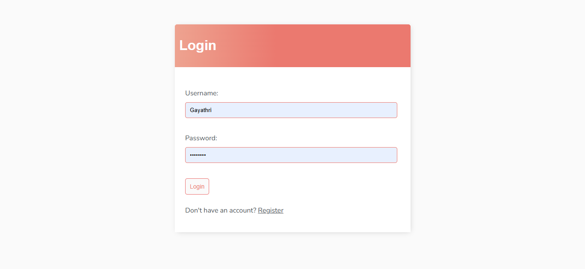
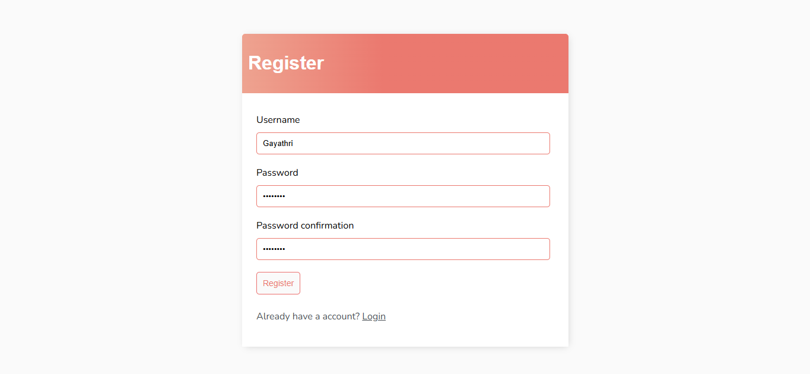
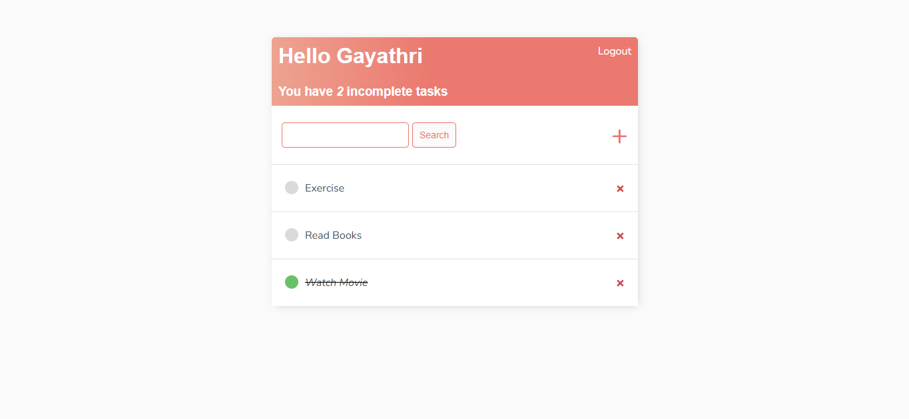
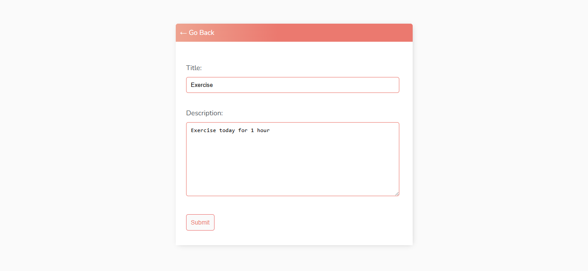
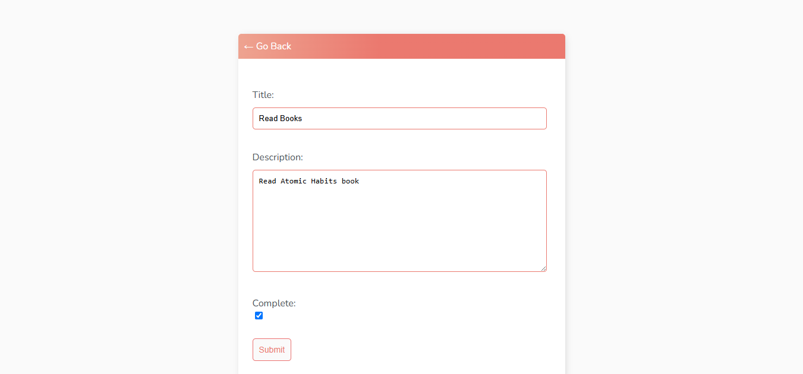
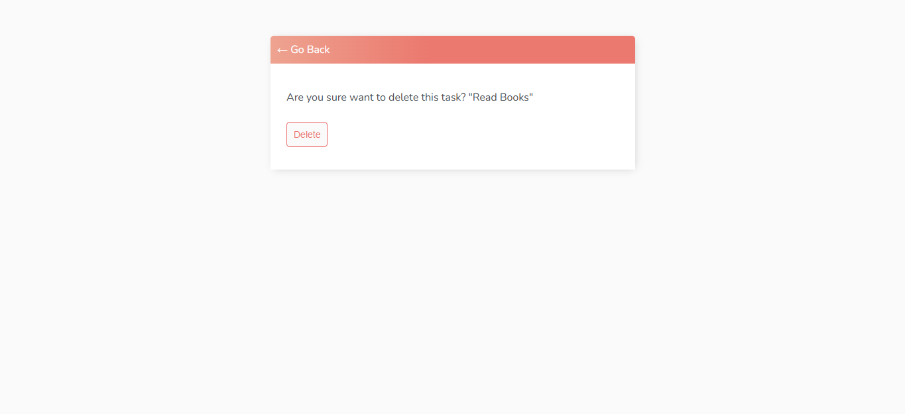
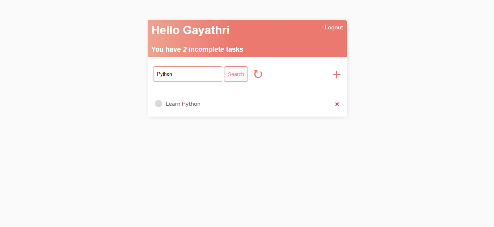

# Django To Do List

A simple and secure **To Do List** web application built using **Django** as a learning project. The application demonstrates Django's authentication system, Class-Based Views (CBVs), model relationships, forms, and complete CRUD operations.

Each registered user has a private workspace where they can manage their own tasks without seeing tasks created by other users.

> **Note:** This project was developed while learning Django by following Dennis Ivy's Django To Do List tutorial, with additional enhancements such as custom validation using Django forms.

---

# Features

* User Registration
* User Login & Logout
* Create Tasks
* View Task List
* Update Tasks
* Delete Tasks
* View Task Details
* Mark Tasks as Complete or Incomplete
* Search Tasks by Title
* User-Specific Task Management
* Authentication-Protected Pages
* UUID-based URLs for Tasks
* Prevent Duplicate Incomplete Tasks (Custom Validation)

---

# Tech Stack

* Python
* Django
* HTML5
* CSS3
* SQLite

---

## Project Structure

```text
djangoTodo/
├── base/                             # Main Django application
│   ├── migrations/                   # Database migrations
│   │   └── 0001_initial.py
│   ├── templates/
│   │   └── base/
│   │       ├── login.html
│   │       ├── main.html
│   │       ├── register.html
│   │       ├── task.html
│   │       ├── task_confirm_delete.html
│   │       ├── task_form.html
│   │       └── task_list.html
│   ├── admin.py                      # Admin site configuration
│   ├── apps.py                       # App configuration
│   ├── forms.py                      # Custom registration and task forms
│   ├── models.py                     # Task model
│   ├── tests.py                      # Test cases
│   ├── urls.py                       # App URL patterns
│   └── views.py                      # Class-based views
│
├── djangoTodo/                       # Project configuration
│   ├── asgi.py
│   ├── settings.py                   # Project settings
│   ├── urls.py                       # Root URL configuration
│   └── wsgi.py
│
├── manage.py                         # Django management script
├── requirements.txt                  # Project dependencies
└── README.md
```

# Screenshots

## Login Page



---

## Registration Page



---

## Task Dashboard

Displays all tasks belonging to the logged-in user.



---

## Create Task



---

## Edit Task



---

## Delete Task



---

## Search Tasks

Search tasks by title.



---

# Getting Started

## Clone the Repository

```bash
git clone https://github.com/GayathriG5787/djangoTodo.git
```

## Navigate to the Project

```bash
cd djangoTodo
```

## Create a Virtual Environment

### Windows

```bash
python -m venv venv
venv\Scripts\activate
```

### macOS / Linux

```bash
python3 -m venv venv
source venv/bin/activate
```

---

## Install Dependencies

```bash
pip install -r requirements.txt
```

---

## Apply Database Migrations

```bash
python manage.py migrate
```

---

## Run the Development Server

```bash
python manage.py runserver
```

---

## Open the Application

```
http://127.0.0.1:8000/
```

---

# Key Django Concepts Practiced

* Django Project Structure
* Django Apps
* Models
* Django ORM
* Class-Based Views (CBVs)
* URL Routing
* Templates
* Template Inheritance
* Model Forms
* Form Validation
* User Authentication
* LoginRequiredMixin
* Django Generic Views
* UUID-based URL Routing
* Database Migrations

---

# Custom Enhancements

In addition to following the tutorial, this project includes:

* Custom form validation to prevent users from creating duplicate **incomplete** tasks with the same title.
* UUID-based task URLs instead of sequential integer IDs.
* User-specific task filtering so users can only access their own tasks.
* Task search functionality using case-insensitive title matching.

---

# Tutorial Reference

This project was created while learning Django from the following tutorial:

**Dennis Ivy – Django To Do List Tutorial**

https://youtu.be/llbtoQTt4qw?si=ZPlehSaqcMMQdgus

Many thanks to Dennis Ivy for creating an excellent beginner-friendly Django tutorial.

---
